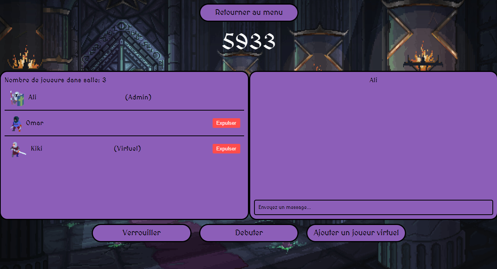
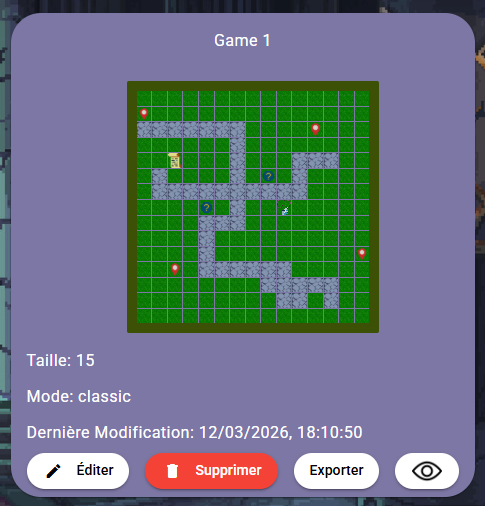
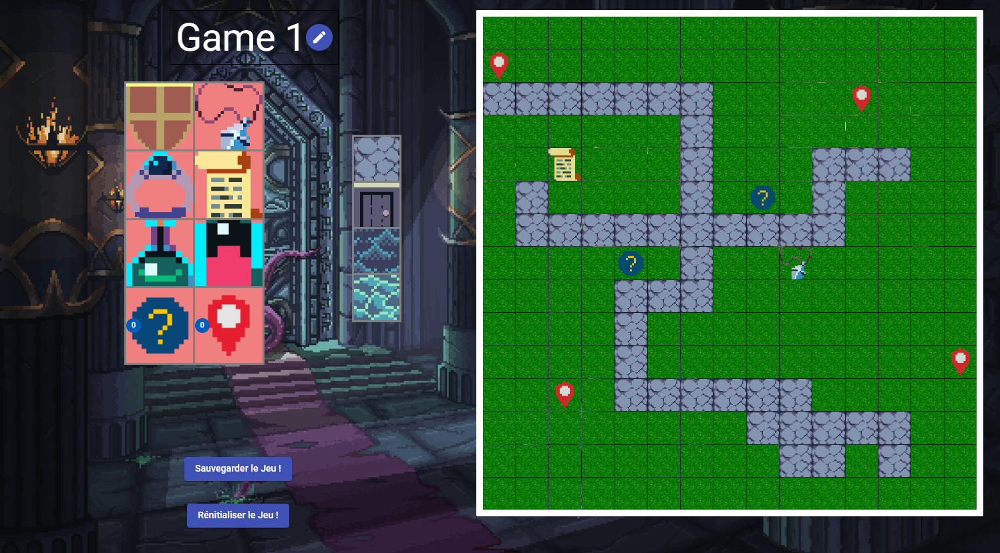

# NgBattle

Multiplayer tactical battle game built with an Angular frontend and a NestJS backend using Socket.IO for real-time gameplay.

## Overview

NgBattle is split into two main applications:

- `client/`: Angular 18 web app (UI, game map, combat interface, inventory, chat, leaderboard, admin tools).
- `server/`: NestJS 10 API and real-time gateway layer (matchmaking, combat logic, movement, inventory, game validation).

Shared domain models live in `common/` and are used across both sides.

## Features

- Real-time multiplayer battles over Socket.IO with synchronized game state
- Turn-based tactical movement and combat on an interactive map
- Inventory and item systems, including unique item randomization
- In-game chat, logs, and player stats tracking
- Match flow management (lobby, joining, matchmaking, game progression)
- Admin tooling for map/game configuration and validation
- Global stats and leaderboard-style progression views
- Virtual player AI support for automated opponents when human players are unavailable

## Tech Stack

- Frontend: Angular 18, Angular Material, SCSS, RxJS, Socket.IO client
- Backend: NestJS 10, WebSockets (Socket.IO), Mongoose, MongoDB
- Testing: Karma/Jasmine (client), Jest (server)
- Tooling: ESLint, Prettier, TypeScript

## Repository Structure

```text
NgBattle/
  client/      Angular application
  server/      NestJS server
  common/      Shared TypeScript models and constants
```

## Prerequisites

- Node.js 20+ (recommended)
- npm 9+
- MongoDB connection string (Atlas or local instance)

## Environment Configuration

Create `server/.env` with at least:

```env
DATABASE_CONNECTION_STRING=mongodb://<user>:<password>@<host>/<db>
PORT=3000
```

Client runtime URL is configured in:

- `client/src/environments/environment.ts` (development)
- `client/src/environments/environment.prod.ts` (production)

Default development API target is `http://localhost:3000`.

## Installation

Install dependencies for both apps:

```bash
cd client
npm install

cd ../server
npm install
```

## Running Locally

Use two terminals.

1. Start the backend:

```bash
cd server
npm start
```

2. Start the frontend:

```bash
cd client
npm start
```

Local URLs:

- Frontend: `http://localhost:4200`
- Backend API: `http://localhost:3000/api`
- Swagger docs: `http://localhost:3000/api/docs`

## Available Scripts

### Client (`client/package.json`)

- `npm start` - run Angular dev server
- `npm run build` - build frontend
- `npm test` - run unit tests
- `npm run coverage` - run tests with coverage
- `npm run lint` - lint source files
- `npm run lint:fix` - auto-fix lint issues
- `npm run format` - format frontend source

### Server (`server/package.json`)

- `npm start` - run NestJS in watch mode
- `npm run build` - compile server
- `npm test` - run Jest tests
- `npm run coverage` - run tests with coverage
- `npm run lint` - lint backend source
- `npm run lint:fix` - auto-fix lint issues
- `npm run format` - format backend source

## Testing and Quality Checks

Run checks in each app directory:

```bash
# Client
cd client
npm run check

# Server
cd ../server
npm run check
```

## Screenshots

Add your screenshots in `docs/screenshots/` (or update paths below).

### Lobby



### Map Selection



### Admin / Map Editor



## Notes

- The server enables CORS globally for local frontend-backend communication.
- API routes are prefixed with `/api`.
- Real-time gameplay communication is handled through NestJS gateways.
